# CPB Shop Website

[View the live project here.](https://ci-ms4-cpb-shop.herokuapp.com)

### The aim of this website is to **provide a prototype commercial website to promote and sell merchandise related to the Crystal Palace Band**.
### It is designed to be responsive and accessible on a range of devices, making it easy to navigate for four distinct groups of users :
-   User Admin for maintaining user access
-   Store Admin for maintaining details of products for sales plus their associated categories
-   Passing consumers who wish to purchase without registering for a profile
-   More regular consumers who by registering via a profile will save time on re-entering personal details and will be able to see their order history

---

## Table of Contents

> + [Overview](#overview)
> + [Description](#description)
> + [Icon Key](#icon-key)
> + [User Experience](#user-experience)
> + [Features](#features)
> + [Database Schema](#database-schema)
> + [Technologies Used](#technologies-used)
> + [References for learning](#references-for-learning)
> + [Testing](#testing)
> + [Project barriers and the solutions](#project-barriers-and-the-solutions)
> + [Code validity](#code-validity)
> + [Version Control](#version-control)
> + [Deployment](#deployment)
> + [Credits](#credits)
> + [Acknowledgments](#acknowledgements)
> + [Support](#support)

**Please note: To open any links in this document in a new browser tab, please press `CTRL + Click`.**

---

# Overview

> There is currently no online portal available to promote/sell merchandise branded for Crystal Palace Band. 
> This site aims to fill that gap whilst also providing another outlet beyond the band website and associated social media accounts for promoting upcoming concerts and events involving the band.

---

# Description

> The CPB Shop produced for this project is dedicated to enabling the Crystal Palace Band brand to reach out to a wider audience increasing awareness of it's existence.
> The initial set of products available for virtual purchase via a test Stripe payment card establishes the basis for setting up a proper live commercial site for the band.

---

[Back to the top](#CPB-Shop-Website)

---

# User Experience

This website project focusses on the standard functionality of an e-commerce site to enable customers to shop for items of varying quantities and size into a virtual shopping bag which can then be turned into a proper order with pop up "toast" notifications when the bag contents are changed and when orders are placed, coupled with formal email notifications of orders placed.
It also provides a secure profile registration and login facility which enables personal maintenance of profile details and access to order history whilst logged in.
The priority focus is on ease of use by the different types of user and a good User Interface experience regardless of the device being used (mobile / tablet / laptop / desktop).

- ## 0. User Stories

The following user stories remain in the scope of the final project delivered :
> - _"As a customer I wish to be able to view all merchandise available without any kind of filtering"_
> - _"As a customer I wish to be able to view merchandise filtered by categories of clothing, homeware, and music"_
> - _"As a customer I wish to be able to view merchandise filtered by a search function"_
> - _"As a customer I wish to be able to view merchandise ordered on price either listing on the cheapest or most expensive first"_
> - _"As a customer I wish to be able to view merchandise ordered on customer ratings either listing on the highest or lowest first"_

> - _"As a customer I wish to be able to easily specify the quantity of each item required"_
> - _"As a customer I wish to be able to select from a range of sizes for clothing items"_
> - _"As a customer I wish to be able to easily add items to / remove items from a virtual shopping bag"_
> - _"As a customer I wish to be able to easily change the quantity of individual items in the virtual shopping bag"_
> - _"As a customer I wish to be able to see the total cost of the items in the virtual shopping bag, with that value being automatically updated when the contents of the shopping bag are altered"_
> - _"As a customer I wish to be able to automatically receive an email copy of my order at the time it is placed"_
> - _"As a customer I wish to be able to view, select and order merchandise regardless of whether or not I'm logged into a personal profile"_
> - _"As a customer I wish to be able to register a profile by secure access which maintains my personal details and order history"_
> - _"As a customer I wish my email to be verified when I set up a profile to prove the integrity of the email address provided"_
> - _"As a customer I wish my login password to be stored in encrypted form and only known to me"_

> - _"As a store admin I wish to be able to add/alter/delete product entries including the pricing, category, rating and images for those products"_
> - _"As a store admin I wish to be able to add/alter/delete blog entries used to promote the merchandise"_
> - _"As a user of this resource (in any capacity) I would like a responsive design that caters for mobile and non-mobile devices"_
> - _"As a registered user of this resource I would like to be able to provide a review of products and be able to edit and delete my own reviews"
> - _"As a user of this resource (in any capacity) I would like to see reviews made by other users"_
> - _"As a user of this resource (in any capacity) I would like to be able to provide comments to blog entries"_

The following user stories were descoped early on in the project due to time constraints :
> - _"As a store admin I would like to be able to maintain real time stock control levels based on orders yet to be fulfilled"_
> - _"As a customer I would like to be able to print out individual order summaries"_

- ## 1. Strategy

> The aim of this project is to facilitate an efficient online shopping experience for customers seeking CPB branded merchandise, hence keeping the UX simple and user-friendly.
>
> ### Project Goals:
>
> - Providing a simple web-based tool to construct music programmes for a band.
> - Maintain the integrity of this resource by only permitting maintenance of available products by superusers.
>
> ### Customer Goals:
>
> - Designed site with Mobile-first approach
> - Easy to construct shopping bag of items.
> - Imagery used for intuitive explanation of the products available.
> - Enable a two-way engagement with users of this site.
> - Fixed navigation bar providing user easy navigation reference.

- ## 2. Scope

> I've decided on an MVP (Minimal Viable Product) approach, which:
>
> - Provides a clean UX for users.
> - Fits in with my current skill-set.
> - Hides content and options according to the user type (ie. logged on via a valid profile or not).

- ## 3. Structure

> The main focus of the structure is to allow Users to quickly focus in on merchandise of interest to them. 
> Short, focused paragraphs of content information to provide enough information, yet not overwhelm.
> A selection of quality images to project the template page the user is on.

- ## 4. Skeleton

> - Wireframes available [here](/static/docs/RLs-CI-MS4-Wireframes.pdf).
> - A multi page website using Django to route to the appropriate app and its associated template pages, dependent on the options selected made up of the following pages :
> -  The Home page provides a textual introduction to the site.
> -  The Products page presents a summary list of merchandise available with a search facility based on the Product name or description. Additional edit capabilities are provided only to superusers for integrity purposes.
> -  The Product Details page provides the name, description, category, rating and (where applicable) the sizes of the merchandise item.
> -  The Blogs page presents a summary list of blog entries for all users to view. Within each blog entry there is the ability for users to provide comments.
> -  The Reviews page presents a summary list of user reviews of products, with registered users being able to add a new review from there.
> -  The Login / Register page.
> -  The User Admin page (only accessible to the User Admin) for the creation, display, search, update and delete of user profiles.
>
> - Fixed navigation bar - Menu headings pointing to each of the available sections (dependent on user type).
>
> - Fixed Footer with links to Contact page and Gig page and Copyright info

- ## 5. Surface

> ### Colours
>
> The colour scheme is based around the "Crystal Palace Band" red jackets with the white and yellow on black band badges.
> For the home page the red has been used for the body background colour for the band badge logo to blend into with text in yellow.
> This contrasts nicely with the white on black generic header section (including navigation bar) and the black on white discount banner and footer.
> The product, order, review and profile pages revert to a basic black on white in the body, with the use of a strong yellow/gold text for the product summary details.
> For the Blogs, Contacts and Gigs pages I've again used the red background to distinguish them as non-merchandise related pages.
> 
> ### Typography
>
> - "Lato" font (with fall-back font of Verdana) for main headings. This font was specifically chosen for the header page title and subtitle.
> - "Oswald" font (with fall-back font of Sans-Serif) for body content.
>
> ### Images
>
> The image selection has been carefully chosen to depict the target audiences for this directory to make this a more welcoming resource.

---

# Features

- ## Current Features

### Create a user profile

* This feature allows the user to:
  * Register for an account with an email address, username, and password.
  * Ensure no typos by entering the password twice, with the site checking to confirm that the passwords match.
  * Ensure no typos by entering the email twice, with the site checking to confirm that the emails match.
  * Ensure the correct email address by sending a verification email to the email address the user has supplied.
  * Store their details for faster checkout.
  * Keep a record of their full order history.

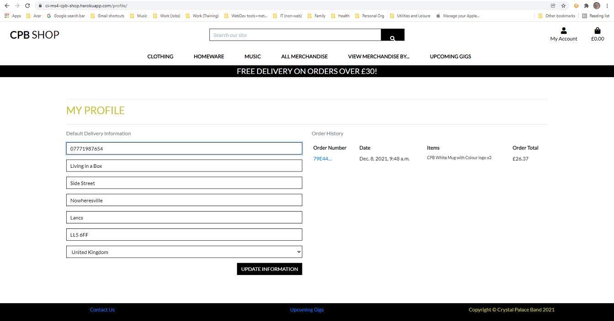

### Products

* This feature allows the user to:
  * View all products on the website.
  * Perform a keyword search for products by name and description.
  * Browse products by category through the main navigation bar.
  * Sort products
    * Alphabetically (A-Z) on product name
    * Alphabetically (Z-A) on product name
    * Alphabetically (A-Z) on category name
    * Alphabetically (Z-A) on category name
    * By price (low to high)
    * By price (high to low)
    * By rating (low to high)
    * By rating (high to low)
  * Click the 'Add to Bag' button for a faster shopping experience, including the ability to choose a size on products with sizes.
  * Click on a product card to view the full product details, including:
    * Name
    * Category
    * Price
    * Image
    * Description
    * Sizes (if relevant)
  * Click the back to top arrow button to return to the top of the page.

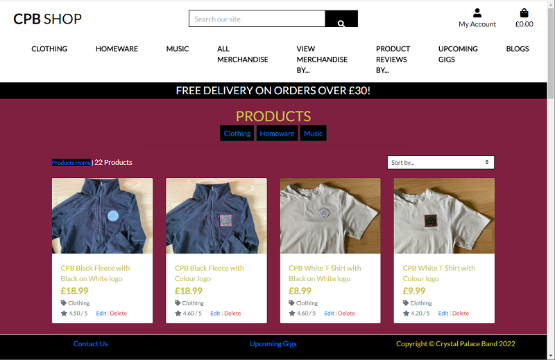

### Create, Edit and Delete products

* This feature allows the superuser to:
  * Add a new product to the store.
  * Edit an existing product.
  * Delete an existing product.
  * Include images, either by URL or by uploading directly from the superuser's computer.
  * Include audio, by uploading directly from the superuser's computer.

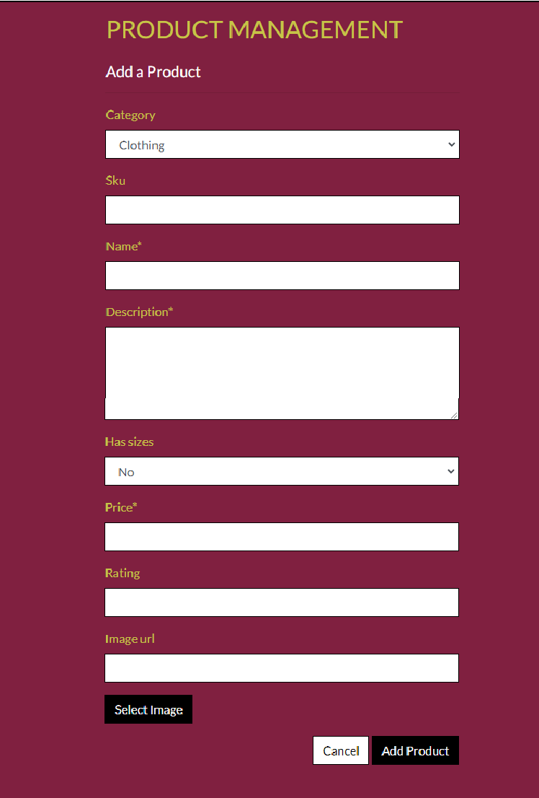

### Product Reviews

* This feature allows the user to:
  * View all existing Product Reviews on the website.
  * Add a new Product Review
  * Sort Product Reviews
    * Alphabetically (A-Z) on review author
    * Alphabetically (Z-A) on review author
    * Alphabetically (A-Z) on product name
    * Alphabetically (Z-A) on product name
    * Alphabetically (A-Z) on category name
    * Alphabetically (Z-A) on category name
    * Oldest to Newest on date posted
    * Newest to Oldest on date posted

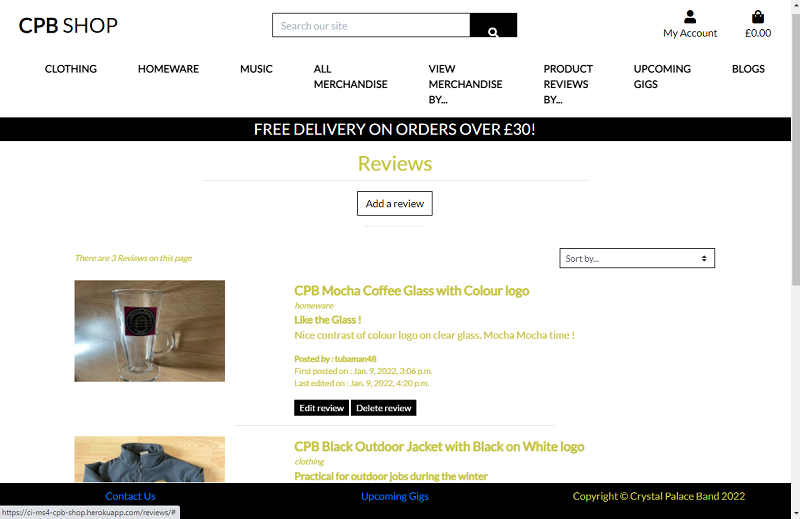

### Blog Posts

* This feature allows the Admin to:
  * Add, Amend, Delete blog entries, allowing an upload of an image of their choice to make the blog stand out.
* This feature allows users to:
  * view the blog posts in summary form.
  * click on a blog post to view the whole blog and any associated comments.
  * add their own comments to individual blog posts.

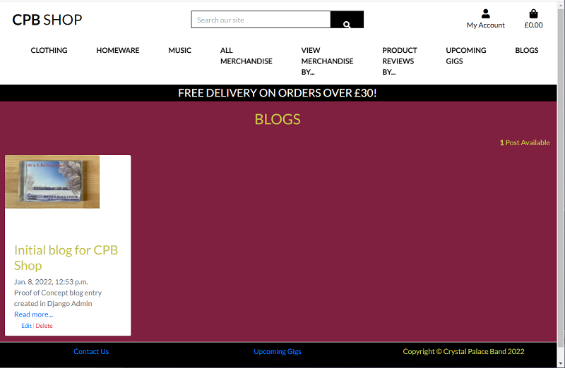

### Shopping Bag

* This feature allows the user to:
  * Add products to the shopping bag.
  * Adjust the quantity of products in the shopping bag.
  * Delete products in the shopping bag.
  * View the grand total and details in the bag.
* When a product is updated, a preview of the shopping bag is displayed in a message.
* The grand total and shipping price are updated when any edits to the shopping bag are made.
* Updating a product quantity to 0 in the shopping bag removes the item from the shopping bag.

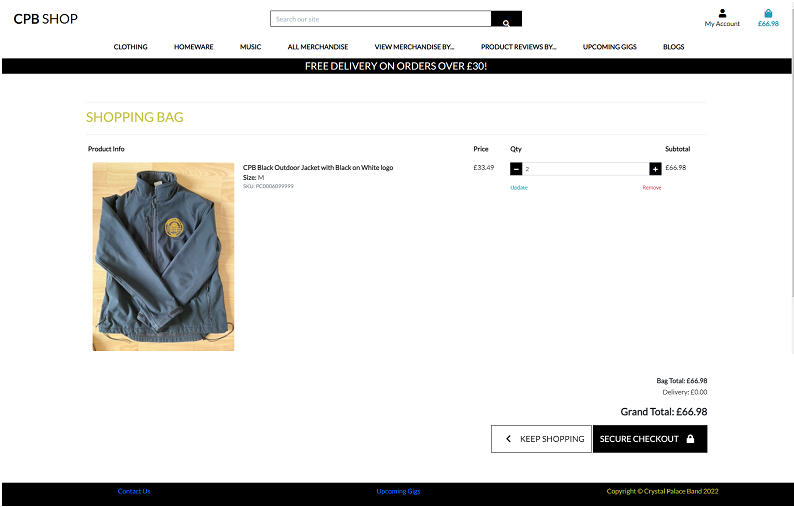

### Checkout

* This feature allows the user to:
  * Check out as a guest.
  * Safely and securely buy the items in their shopping bag through Stripe.
  * The shipping details will be filled from any details given in the user profile.
  * The user can select the 'Remember my details' checkbox in the checkout form to save their latest details. This is helpful when:
    * No details are currently saved in the user's profile, and the user wishes to save their details.
    * Any of the user's details have changed from what is saved in their profile.
* The card details form is connected to Stripe, a payment platform. This ensures a fully secure payment.
* When the user confirms checkout, an animated loading screen shows whilst the payment details are checked by Stripe.

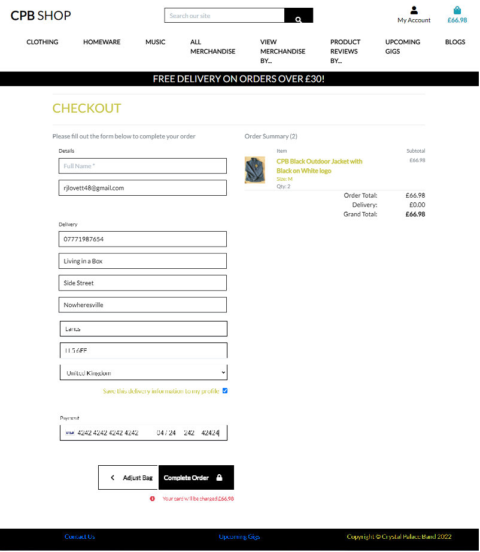

### Payment

* If the payment fails:
  * The user is directed back to the checkout form.
  * The user is shown a message that the payment failed.
* If the payment succeeds:
  * The user will be sent a confirmation email.
  * The email contains the full order details and order number.
  * The user will be redirected to the checkout success page.
  * A message will display, informing the user that the payment succeeded, containing the order details and order number.
  * The order will be added to the user's order history in their profile.

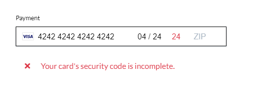

### Navigation bar

The navigation menu will help the user move easily across all pages. 
The navigation buttons update depending on whether a user is logged in, and whether that user is the admin.
The navigation bar changes depending on user status and screen size:

| Nav Link | &#128683; | &#128100; | &#128272; |
|-------|-----|-----|-----|
| Logo (Homepage) | &#9989; | &#9989; | &#9989; |
| Home | &#9989; | &#9989; | &#9989; |
| Products | &#9989; | &#9989; | &#9989; |
| Product Details | &#9989; | &#9989; | &#9989; |
| Add Products | &#10060; | &#10060; | &#9989; |
| Add Reviews | &#10060; | &#9989; | &#9989; |
| Edit Reviews | &#10060; | &#9989; | &#9989; |
| Delete Reviews | &#10060; | &#9989; | &#9989; |
| Add Blog Posts | &#10060; | &#10060; | &#9989; |
| Edit Blog Posts | &#10060; | &#10060; | &#9989; |
| Delete Blog Posts | &#10060; | &#10060; | &#9989; |
| Add Comments to Posts | &#9989; | &#9989; | &#9989; |
| Contact Us | &#9989; | &#9989; | &#9989; |
| Upcoming Gigs | &#9989; | &#9989; | &#9989; |
| Product Management | &#10060; | &#10060; | &#9989; |
| Profile | &#10060; | &#9989; | &#9989; |
| Log Out | &#10060; | &#9989; | &#9989; |
| Log In | &#9989; | &#10060; | &#10060; |
| Register | &#9989; | &#10060; | &#10060; |

##### Icon key

&#128272; <-- Superuser only access

&#128100; <-- Logged In Only

&#128683; <-- Logged Out only

&#9989; <-- Yes / Visible

&#10060; <-- No / Not visible

* Navigation bar

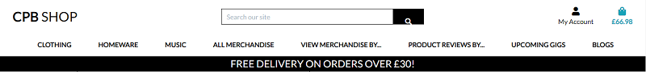

* Logged in

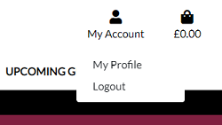

* Logged out

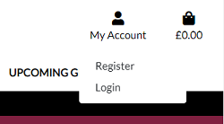

* An admin

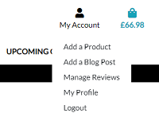

* On small screen sizes

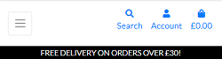
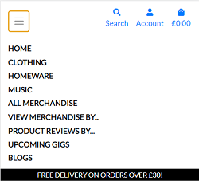

#### Auto-updating copyright year

* The copyright year auto-updates to the current year.

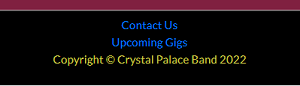

> - Designed with HTML5, CSS3, Javascript, Python and Bootstrap within a Django framework deployed onto Heroku using a Heroku Postgres database.
> - Site made up of multiple template pages routed to via app.py made up of a fixed navigation bar followed by the appropriate content as outlined above under the UX Skeleton section
> - Fixed navigation allows the user to easily navigate, regardless of which section they are currently positioned in.
> - Fixed, stacked images for mobile views.

- ## Future Features Left to Implement when time allows

> - Enhance the Product Review function to provide a star rating from 1 to 5.
> - Enhance the Upcoming Gigs page to use a database of gigs events maintained by the administrator.
> - Enable tickets to be paid for in advance for relevant gigs (including them in the shopping bag of items).

---

# Database

> The database schema for this project is diagrammed below :

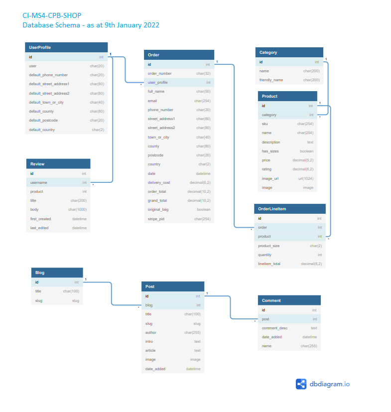

> - The early development of it utilised SQLite within a local host environment (this excluded the custom models developed later for the Blog and Review functionality).
> - The core apps of bag, checkout, product, and profile) are largely a reuse of the functionality provided in the CI LMS sample project Boutique Ado.
> - The reviews app uses a custom model that utilises a single Review class which ties into the allauth UserProfile class.
> - The blog app uses a custom model that links together the Blog, Post & Comments classes.
> - The whole schema was finally deployed within a POSTGres relational database structure accessible from both the local host server and the live Heroku environment.

---

# Technologies Used

## 1. Languages Used

> - [HTML5](https://en.wikipedia.org/wiki/HTML5).
>
> - [CSS3](https://en.wikipedia.org/wiki/Cascading_Style_Sheets).
>
> - [JavaScript](https://en.wikipedia.org/wiki/JavaScript)
>
> - [Python3](https://www.python.org/)

## 2. Frameworks and Libraries Used

> - [Django](https://www.djangoproject.com/)
>
> - [Pip3](https://pip.pypa.io/en/stable/)
>
> - [dnspython](https://www.dnspython.org/)
>
> - [jQuery](https://jquery.com/)
>
> - [Jinja](https://jinja.palletsprojects.com/en/3.0.x/)
>
> - [Bootstrap](https://getbootstrap.com/)
>
> - [FontAwesome](https://fontawesome.com/) - used on all pages throughout the website to add icons for aesthetic and UX purposes.

## 3. Workspace, version control and Repository storage

> - [GitPod](https://github.com/mkuti/corklagos-venture/blob/master/gitpod.io) - Main workspace IDE (Integrated Development Environment)
>
> - [Git](https://git-scm.com/) - Distributed Version Control tool to store versions of files and track changes.
>
> - [GitHub](https://github.com/) - A cloud-based hosting service to manage my **Git** repositories.

## 4. Other

> - [Heroku](https://www.heroku.com/) used to deploy live site
> - [PostgreSQL](https://www.postgresql.org/) used to host database information.
> - [RandomKeygen](https://randomkeygen.com/) used to create a strong password for required  `<SECRET_KEY>`.
> - [Lighthouse](https://developers.google.com/web/tools/lighthouse) for performance review.
> - [Autoprefixer](https://autoprefixer.github.io/) Parses CSS and adds vendor prefixes.
> - [Google Mobile-Friendly Test](https://search.google.com/test/mobile-friendly) Mobile-friendly check on site.
> - [Website Page Test](https://www.webpagetest.org/) Runs a website speed test from multiple locations around the globe using real browsers (IE and Chrome) and at real consumer connection speeds.
> - [Responsinator](http://www.responsinator.com/) Checks rendering across a variety of device types in landscape and portrait modes.  
> - [Online-Spellcheck](https://www.online-spellcheck.com/) Online spelling and grammar checks.
> - [DBDiagram](https://dbdiagram.io/home) used to generated the database schema diagram.

## 5. IDE Extensions used in GitPod

> - Auto Close Tag
> - Auto Nametag
> - Bracket Pair Colorizer
> - Code Spellchecker
> - Prettier - Code Formatter
> - Indent-Rainbow

---

# Resources

> - [Code Institute Course Content](https://courses.codeinstitute.net/) - Main source of fundamental knowledge.
> - Code Institute **SLACK Community** - Main source of assistance, especially the **JimLynx (aka Jim Morel)** webinar on the "Introduction to Git Workflow" which made the process of adding, committing and pushing in gitpod so much smoother.
> - [Stack Overflow](https://stackoverflow.com/) - General resource.
> - [Youtube](https://www.youtube.com/) - General resource.
> - [CSS-Tricks](https://css-tricks.com/) - General resource.
> - [W3.CSS](https://www.w3schools.com/w3css/4/w3.css) - General resource.
> - [CommonMark](https://commonmark.org/help/) - For Markdown language reference.
> - [Coolors](https://coolors.co/) - Find matching colour palette for site.
> - [TinyPNG](https://tinypng.com/) - Efficient compression of images for site.
> - [Am I Responsive](http://ami.responsivedesign.is/) - Responsive website mock up image generator.
> - [Balsamiq](https://balsamiq.com/wireframes/) - Wireframing design tool.
---

# Testing

Due to the size of the testing section, I have created a separate document for it. 

[Click here to view the full testing steps](static/docs/TESTING.md), which were completed on every device and browser, and screenshots of testing.

### Solved Bugs
1. 	Stripe webhook failures 
    The following sequence started off with an HTTP 401 error, which progressed via an HTTP 400 error and HTTP 500 error before fully resolving with 200 success message.
    This occurred before the deployment to Heroku whilst testing via a local 8000 port :

    • HTTP 401 (Not Authorised) caused by Stripe webhook URL becoming invalid due to gitpod workspace server element changing.
	• By replacing the webhook setup in Stripe this generated a new STRIPE_WH_SECRET whsec_ key value, so the 401 got replaced with a HTTP 400 (Bad Message) due to the MS4_STRIPE_WH_SECRET variable value in the gitpod workspace becoming out of date.
	• By updating the MS4_STRIPE_WH_SECRET variable value in the gitpod workspace with the new whsec_ value, the 400 got replaced by a HTTP 500 (Server Error) which pointed the finger at an abort in Django Code due to a Not NULL issue with optional street_address2 field in the UserProfile model.
	• Reinstated explicit null=True values for all UserProfile fields (as they are all optional fields) within profiles/models.py, which shifted the same 500 issue to the optional Orders fields (postcode, street-address2 and county) within checkout/models.py.
	• Reinstated explicit null=True values for optional fields postcode, street-address2 and county within Orders model, which fully resolved issue.

---

# Code validity

> - HTML   - [W3C](https://validator.w3.org/) - Markup Validation
>
> - CSS    - [W3C](https://jigsaw.w3.org/css-validator/) - CSS Validation
>
> - JS     - [JSHint](https://jshint.com/) - Javascript Validation
>
> - PYTHON - [PyLint](https://pylint.org/) - Python Validation
>
> - TAGS   - [Closing Tag Checker for HTML5](https://www.aliciaramirez.com/closing-tags-checker/) - Validates all tags are opening and closing correctly.

---

# Version Control

> - Used Git for version control.

---
# Deployment

[Please click here for all Deployment steps and requirements](static/docs/DEPLOYMENT.md).

[Back to the top](#CPB-Shop-Website)

---

# Credits

> ## Code
>
> - [Font Awesome](https://fontawesome.com/): Library of icons used for social media and download links.
> - [W3.org](https://www.w3.org/2005/10/howto-favicon) - How to add a Favicon to site.
> - [Code Institute](https://codeinstitute.net/) This website was made with the help of the tutorials from Code institute for the Boutique Ado project by Chris Zielinski. The code has been customised and improved to fit this project.
> - Inspiration for user profile management and 'CRUD' processing from 'Boutique Ado' Mini-Project in Full Stack Development Module.
> - Additional significant inspiration and coding techniques were gleaned from the following recent MS4 project for Code Institute :
>  - -   Lead Shot Hazard by *Abi Harrison*    https://github.com/Abibubble/ms4-lead-shot-hazard
> - The rapid development of the Product Review and Blog apps to provide my 2 custom models was largely drawn (in terms of inspiration and logical useable code that I could understand and easily adapt) from the following recent MS4 projects for Code Institute :
  * Inginuity by *Conac Breslin*    https://github.com/ConacBreslin/inginuity
  * Stile by *Sophie Boyle*   https://github.com/sophieboyle1/stile-ms4
  * Bubbles by *Gomathi Shankar*   https://github.com/gomathishankar28/ms4_bubbles
>      
> ## Media
>
> - The main Crystal Palace Band logo used in this project is _owned and provided for by Crystal Palace Band of which I am a committee member.
> - The mocked up photos of the product images are all my own work.
> - The "CPB Shop" site icon was created via my tubaman48 account at [vectr.com](https://vectr.com/).
>
> ## Content
>
> - All text content is _self-written_
> - The details in the deployment section is largely sourced from the README.md generated by Abi Harrison for https://github.com/Abibubble/ms4-lead-shot-hazard
>

# Acknowledgements

> - My mentor, Antonio Rodriguez, at Code Institute, for continuous helpful feedback and support.
> - The team at Code Institute, for teaching me the necessary skills to create this site.
> - Numerous threads on the CI Slack channels plus a couple of significant Tutor Support sessions helped me understand and overcome the challenges of Django, Postgres, Heroku and AWS deployments.
> - Naoise "Gaff" Gaffney for his info packed webinar on preparing for MS4.
> - Django Documentation has been used to ensure correct syntax usage throughout the code.
> - Stack Overflow has been used to help with deciphering the Django error codes, and searching for bug fixes.
>   These examples significantly helped me with formatting of the database schema / navigation link accessibility table within features / deployment sections within this README.
> - **CI staff** and **Slack Community** for always being on-hand with questions posted and assistance requests.
> - A special call out goes to the CI Student Care team who have been very accommodating and motivational, especially on my last 2 projects (MS3 and MS4).
> - Everyone that takes part in the Slack calls, specifically from the **#In-It-Together** and **#London Community** channels.

# Support

> For any issue resolution or assistance, please email Richard Lovett on rjlovett48@gmail.com

---